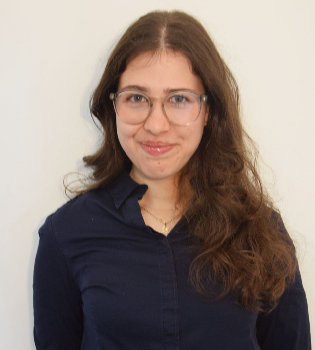

::: {.hero .reveal}
::: {.grid .align-items-center .hero-grid}
::: {.g-col-12 .g-col-lg-8}
::: {.hero-kicker}
COMPUTATIONAL GENOMICS · PROBABILISTIC MODELLING · MACHINE LEARNING FOR BIOLOGY
:::

# Computational methods for genomic sequence analysis.

I am a **data scientist and computational genomics researcher** currently pursuing the **M2 GENIOMHE-AI at Université Paris-Saclay**. My work focuses on probabilistic modelling, genomic data analysis, and machine learning for biomedical research, with current research on **CRISPR–Cas9 off-target prediction**.

::: {.hero-actions}
[Explore research](research.qmd){.btn .btn-primary} [Projects](projects.qmd){.btn .btn-soft} [View CV](cv.qmd){.btn .btn-soft} [Download CV](assets/Gaia_Bianciotto_CV.pdf){.btn .btn-soft download="Gaia_Bianciotto_CV.pdf"}
:::

::: {.social-row}
[LinkedIn ↗](https://www.linkedin.com/in/gaia-bianciotto-269056312/){.social-pill target="_blank"}
[GitHub ↗](https://github.com/gaiabianciotto){.social-pill target="_blank"}
[Email](mailto:gaia.bianciotto@etud.univ-evry.fr){.social-pill}
:::
:::

::: {.g-col-12 .g-col-lg-4 .hero-photo-wrap}
{.hero-photo fig-alt="Portrait of Gaia Bianciotto"}
:::
:::
:::

::: {.section-head .reveal}
## Selected research
[View all research →](research.qmd){.section-link}
:::

::: {.bento-grid .reveal}
::: {.bento-panel .panel-teal .panel-large}

FLAGSHIP PROJECT · GÉNÉTHON

### Probabilistic CRISPR–Cas9 off-target modelling

I investigate **pair Hidden Markov Models (PHMMs)** for guide–target sequence analysis, with a focus on alternative alignment paths and uncertainty-aware prioritisation of potential off-target sites.

CRISPRPHMMGenomicsSequence alignment

[Explore the research →](research.qmd){.panel-cta}
:::

::: {.bento-panel .panel-blue}

CURRENT FOCUS

### Alignment uncertainty

Studying how probabilistic sequence models can preserve uncertainty instead of collapsing evidence into one deterministic alignment.
:::

::: {.bento-panel .panel-sage}

COMPUTATIONAL WORK

### Genome-scale analysis

Python and Linux workflows for candidate generation, sequence analysis, benchmarking, and reproducible experiments.
:::

::: {.bento-panel .panel-ice}

RESEARCH INTERESTS

### Where I want to go next

Computational genomics · precision medicine · probabilistic biology · machine learning for biomedical research
:::
:::

::: {.mini-panel-grid .reveal}
::: {.mini-panel}

01

**Probabilistic modelling**

PHMMs · uncertainty · Bayesian thinking
:::
::: {.mini-panel}

02

**Genomic computation**

Sequence analysis · genome-wide workflows
:::
::: {.mini-panel}

03

**Machine learning**

PyTorch · TensorFlow · statistical learning
:::
::: {.mini-panel}

04

**Research engineering**

Python · Linux · Git · Docker
:::
:::

::: {.cta-strip .reveal}

NEXT STEP

**Open to PhD and research opportunities** in computational genomics, bioinformatics, and machine learning for biology.

[Get in touch](mailto:gaia.bianciotto@etud.univ-evry.fr){.btn .btn-primary}
:::
